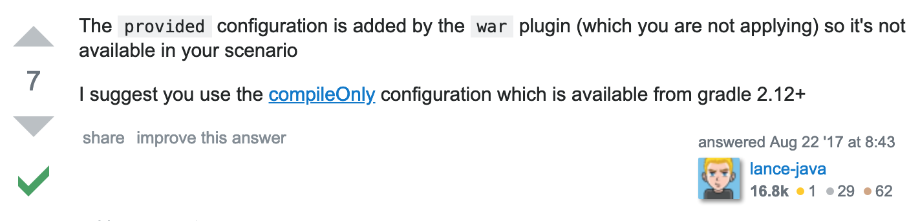

问题：Gradle添加依赖后未自动下载包
    
1、出现问题的可能性原因
    
    1. 添加方式错误(依赖地址错误)
    2. 未刷新
    
2、解决问题方案
    
    1. 查询https://mvnrepository.com/寻找镜像地址
    2. 进行gradle build刷新 
    -> 出现问题
    Could not find method provide() for arguments [{group=javax.servlet, name=javax.servlet-api, version=3.1.0}] on object of type org.gradle.api.internal.artifacts.dsl.dependencies.DefaultDependencyHandler.
    意思：无法找到provide(参数=servlet.api)方法
    -> 去Google搜索解决问题的方案

    
    -> 把provide() 改为 compile()再进行刷新，成功下载依赖包
    
问题：解决方案上说如果添加了war插件，就可以用provide()但我的build.gradle里
本来就写了

     plugins {
         id 'java'
         id 'war'
         id 'idea'
     }
     
所以感觉这不是这个原因。
